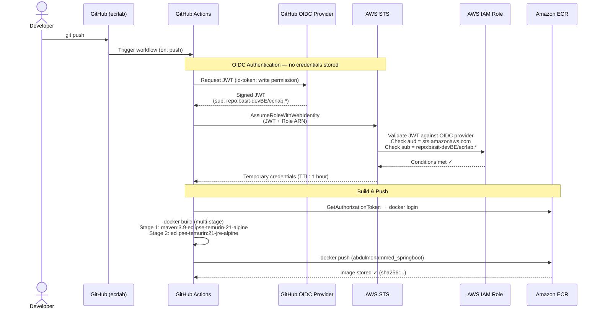
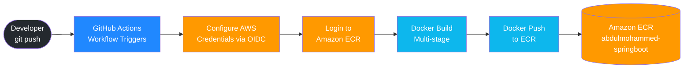

# Spring Boot → Docker → Amazon ECR

Automated pipeline that builds a Spring Boot application as a Docker image and pushes it to a private Amazon ECR repository using GitHub Actions with OIDC-based authentication. No AWS credentials are stored in GitHub.

---

## Architecture

### OIDC Authentication & Image Push Flow



---

### CI/CD Pipeline Overview



---

## Stack

| Component | Technology |
|-----------|-----------|
| Application | Java 21 / Spring Boot 3.3 |
| Containerization | Docker (multi-stage build) |
| Base image | `eclipse-temurin:21-jre-alpine` (~92 MB) |
| CI/CD | GitHub Actions |
| Authentication | GitHub OIDC → AWS IAM |
| Container Registry | Amazon ECR (private) |
| Infrastructure | AWS CloudFormation |

---

## Security Design

- **No static AWS credentials** stored in GitHub — authentication is handled entirely via OIDC token exchange
- **Temporary credentials** issued by AWS STS with a 1-hour TTL, valid only for the duration of the workflow run
- **Least-privilege IAM role** — ECR push actions scoped to the specific repository ARN only
- **Repository-scoped trust policy** — only `basit-devBE/ecrlab` can assume the IAM role
- **Non-root container** — application runs as `appuser` inside the Docker image
- **Image scanning** enabled on push — AWS Inspector scans every image for CVEs
- **HTTPS enforced** via ECR repository policy — denies all non-TLS requests

---

## Infrastructure (CloudFormation)

| Stack | Template | What it creates |
|-------|----------|----------------|
| `ecr-springboot-lab-repo` | `infra/ecr-repository.yml` | Private ECR repo with scanning, lifecycle policy, repo policy, AES-256 encryption |
| `ecr-springboot-lab-oidc` | `infra/github-oidc-role.yml` | GitHub OIDC provider + least-privilege IAM role |

---

## Image

```
124355645722.dkr.ecr.us-east-1.amazonaws.com/abdulmohammed-springboot:abdulmohammed_springboot
```

**Endpoint:** `GET /hello`
```json
{
  "message": "Hello from Abdul Mohammed's Spring Boot ECR Lab!",
  "student": "Abdul Mohammed",
  "image": "abdulmohammed_springboot",
  "timestamp": "2026-07-01T18:49:59Z"
}
```
